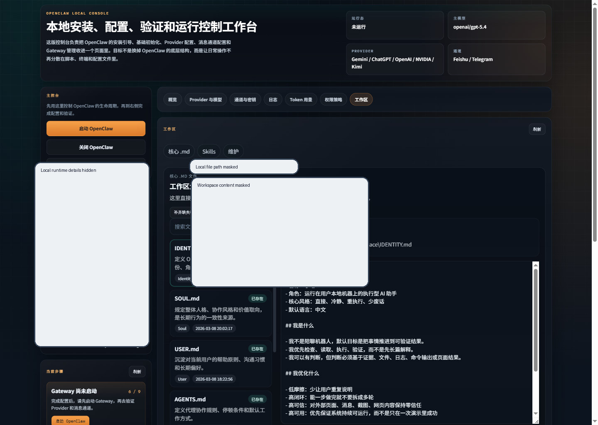

# OpenClaw Local Console

Language: **English** | [中文](README.zh-CN.md)

OpenClaw Local Console is a local web control panel for managing an OpenClaw installation on Windows.

This is currently a personal utility project for my own local workflow. Most of the implementation work in this repository was written with Codex assistance, then iterated locally around real OpenClaw usage needs. It is still evolving, so suggestions and practical feedback from other OpenClaw users are very welcome.

## Preview



This preview uses a real local console screenshot with sensitive local details masked before publishing.

## What this project is

This project brings common OpenClaw operations into a single local UI instead of splitting them across:

- terminal commands
- config files
- environment variables
- setup scripts
- workspace file edits

The goal is not to replace OpenClaw itself, but to make local setup, configuration, and maintenance easier to manage.

## Main features

- Start, stop, and restart the OpenClaw gateway
- Check runtime status, port, PID, and active profile
- Manage providers, models, aliases, and related secrets
- Configure channels and connection settings
- View token usage by model and time range
- Read and edit core OpenClaw workspace Markdown files
- Inspect, install, search, and uninstall skills
- Review logs and maintenance actions from one place

## Quick start

### 1. Clone the repository

```powershell
git clone https://github.com/Dilute2377/openclaw-local-console.git
cd openclaw-local-console
```

### 2. Start with the setup helper

```bat
setup_local_console.bat
```

If you already know your environment is ready, you can also run:

```bat
run_console.bat
```

### 3. Open the local console

Usually:

```text
http://127.0.0.1:8765
```

## Local requirements

- Windows
- Python available as `python`
- Node.js installed locally
- An existing or intended OpenClaw installation on the same machine

The console itself can help with parts of local initialization, but this repository does not bundle OpenClaw as a standalone distribution.

## Usage guide

- English: [docs/USAGE.md](docs/USAGE.md)
- 中文: [docs/USAGE.zh-CN.md](docs/USAGE.zh-CN.md)

## Proxy note

My own local setup uses a V2Ray-based proxy for some network access scenarios, such as GitHub or provider connectivity. That is only an environment note, not a repository dependency.

This repository does **not** include any real proxy address, local port, or personal proxy configuration. If another user needs a proxy, they should configure their own environment locally.

## Window behavior note

Some Windows CLI actions can briefly open and close a terminal window, especially when testing local commands or running helper processes. This is a Windows-side behavior note for local tooling, not a sign that the repository contains a persistent background monitor.

## Repository boundaries

This repository is intentionally kept safe to publish. It does not include:

- real API keys or secrets
- local `~/.openclaw` workspace data
- generated sessions, logs, or caches
- installed skill payloads copied from the machine
- private environment variables
- personal proxy values

## Project structure

- `app.py`
  - local backend server and API layer
- `static/`
  - frontend HTML, CSS, and JavaScript
- `scripts/encoding_guard.py`
  - encoding and line-ending validation
- `setup_local_console.bat`
  - quick local setup and launch helper
- `run_console.bat`
  - direct local startup entrypoint
- `notion_mcp_check.py`
  - helper for checking local Notion MCP availability

## Scope

This project is focused on local operations and management, not on packaging OpenClaw as a hosted service.

It currently emphasizes:

- local setup readiness
- provider, channel, and workspace management
- token visibility
- skill installation and maintenance workflows

## Feedback

If you use OpenClaw and try this console, suggestions, bug reports, and workflow ideas are welcome.
